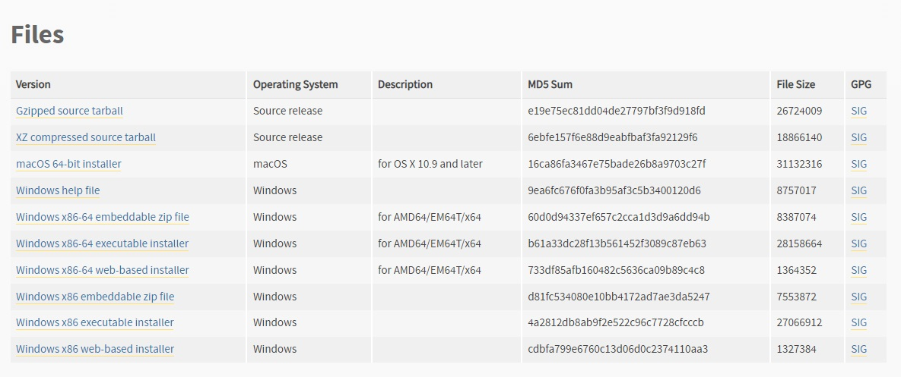

[](https://git.io/typing-svg)<br>
[](https://git.io/typing-svg)<br>
[](https://git.io/typing-svg)<br>
<div align="center">
  
  <h1>
  Научная работа:<br>
    РАЗРАБОТКА ОХРАННОЙ КЛИЕНТ-СЕРВЕРНОЙ СИСТЕМЫ ОПЕРАТИВНОГО КОНТРОЛЯ И УПРАВЛЕНИЯ ДОСТУПОМ
</h1>
</div>

---

### :hammer_and_wrench: Language:
 &nbsp;

---

<p><br>Охранная клиент-серверная система оперативного контроля и управления доступом - это инновационное решение, предназначенное для обеспечения безопасности и контроля в доступе к охраняемым объектам. Она основана на передовых технологиях и позволяет эффективно управлять доступом, контролировать проходы, авторизовать пользователей и отслеживать их действия. Система предназначена для использования в широком спектре объектов - от офисных зданий и складов до промышленных предприятий и государственных учреждений. Она является надежным инструментом для обеспечения безопасности и контроля доступа, который позволяет организовать эффективное управление безопасностью на объекте.<br>
<br>Целью этой работы является обеспечение безопасности и контроля доступа к охраняемым объектам. Предлагаемая система позволяет эффективно управлять доступом, контролировать проходы, авторизовать пользователей и отслеживать их действия. Она также позволяет оперативно реагировать на возможные угрозы безопасности и быстро принимать меры по их предотвращению. Кроме того, система предоставляет возможность сократить затраты на охрану объекта, уменьшить количество ошибок и исключить возможность несанкционированного доступа к конфиденциальной информации или материальным ценностям. Охранная клиент-серверная система оперативного контроля и управления доступом позволяет создать высокий уровень безопасности на объекте и повысить эффективность работы охранного персонала.
</p>

---

### :woman_technologist: Установка :
<a>Первым делом нужно скачать и установить чистый Python V 3.9.0: [](https://www.python.org/downloads/release/python-390/)</a><br>


Тут вы можете выбрать установщик для вашей версии ОС:


```

